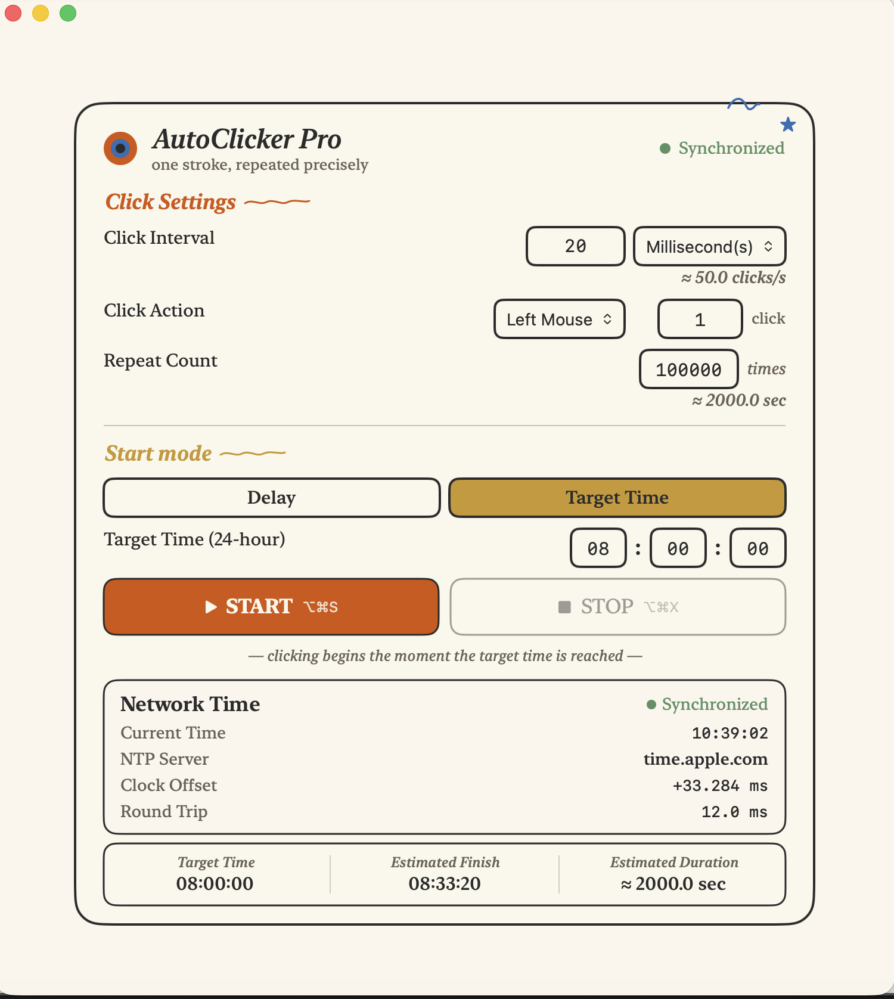

<div align="center">


# AutoClicker Pro

<p>
  
  
  
  
</p>

AutoClicker Pro is a native macOS auto clicker with high-precision scheduling, Target Time automation, and optional SNTP time synchronization.

<p align="center">
  
</p>

</div>

---

## Features

- **High-precision scheduling** — Uses monotonic deadlines and `DispatchSourceTimer` scheduling to minimise long-term drift.
- **Target Time mode** — Starts at a specific `HH:mm:ss` time, schedules passed times for the following day, and displays a live millisecond countdown.
- **Delay mode** — Preserves the standard workflow for starting after a configurable delay.
- **SNTP synchronization** — Measures clock offset, round-trip delay, and synchronization status using `time.apple.com`, `time.cloudflare.com`, and `pool.ntp.org`. If synchronization fails, scheduling continues with the local clock.
- **Mouse and keyboard automation** — Supports configurable actions, intervals, range intervals, and repeat counts, plus optional mouse-movement start and stop controls.
- **Keyboard shortcuts** — Provides global shortcuts for starting and stopping automation.
- **Auto-save settings** — Persists click settings and application preferences automatically.
- **Keep window on top** — Keeps the main window visible above other applications when enabled.
- **Multi-language support** — Includes English, German, and Latin American Spanish localizations.

---

## Requirements

- macOS 13 or later
- Accessibility permission for simulated input

---

## Installation

### Download

Download the latest packaged build from [GitHub Releases](https://github.com/almost109/AutoClicker-Pro/releases) when available.

If no release asset is listed for the current version, build the application from source.

### Build from Source

```bash
git clone https://github.com/almost109/AutoClicker-Pro.git
cd AutoClicker-Pro
open "auto-clicker pro.xcodeproj"
```

In Xcode:

1. Select the `auto-clicker` scheme.
2. Choose **Product → Run**, or press <kbd>⌘R</kbd>.

---

## Permissions

AutoClicker Pro requires Accessibility permission to simulate mouse and keyboard input.

1. Open **System Settings**.
2. Go to **Privacy & Security → Accessibility**.
3. Enable **AutoClicker Pro**.
4. Return to the application. It will detect the permission automatically.

---

## Keyboard Shortcuts

The default global shortcuts are:

| Action | Shortcut |
| --- | :---: |
| Start | <kbd>⌥⌘S</kbd> |
| Stop | <kbd>⌥⌘X</kbd> |

Shortcuts can be changed in the application settings.

---

## Tech Stack

- **Swift** — Application and scheduling logic
- **SwiftUI** — Native macOS interface
- **DispatchSourceTimer** — Precise, RunLoop-independent scheduling
- **Network framework** — Asynchronous SNTP communication
- **[Defaults](https://github.com/sindresorhus/Defaults)** — Persistent application settings
- **[KeyboardShortcuts](https://github.com/sindresorhus/KeyboardShortcuts)** — Configurable global shortcuts

---

## License

Distributed under the MIT License. See [LICENSE](LICENSE) for details.

---

<div align="center">

Built with ❤️ using Swift & SwiftUI

</div>
